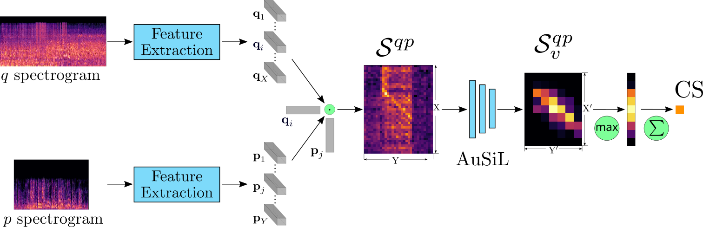

# **Audio-based Near-Duplicate Video Retrieval with Audio Similarity Learning**
This repository contains the implementation of the 
audio similarity learning approach presented in 
[Audio-based Near-Duplicate Video Retrieval with Audio Similarity Learning](https://arxiv.org/abs/2010.08737).
It provides code for the calculation of similarities between a query and database videos,
based exclusively on the audio content.
Given an input video, the Mel-spectrogram of its audio channel is generated
and divided into overlapping time segments.
The Mel-spectrogram segments are then fed to a pre-trained 
Convolutional Neural Network (CNN) to compose a representative descriptor
by exploiting features extracted from its intermediate layers.
The similarity between two compared videos is computed by a trainable module 
that is capable of capturing temporal relations between the videos' audio.



## Prerequisites
* Python 3
* Tensorflow 1.14
* Pytorch 1.3.1 (for feature extraction)

### Extract features

* Create a file that contains the videos. Each line should contain a video id and a path to its corresponding video file, seperated by a space character. For example:
```bash 
_001Mhf5lfE videos/_001Mhf5lfE/video.mp4
001Y2tgRU18 videos/001Y2tgRU18/video.mp4
003bYgAXoDg videos/003bYgAXoDg/video.mp4
003NlcaJl2Y videos/003NlcaJl2Y/video.mp4
                                            ...                           
```

* Run the following to extract the video features to the specified location.
```bash
python extract_features.py -f='videos.txt' -o='features/'
```

### Calculate video similarities

* Create a file that contains the queries, similar to the previous step. Each line should contain a video id and the path to its corresponding feature file. For example:
```bash
_001Mhf5lfE features/_001Mhf5lfE/wlaf.npz
001Y2tgRU18 features/001Y2tgRU18/wlaf.npz
003bYgAXoDg features/003bYgAXoDg/wlaf.npz
003NlcaJl2Y features/003NlcaJl2Y/wlaf.npz
                                            ...
```

* Create a file with the same format for the database videos.
  
* Run the following command to calculate the similarity between the query and database videos.

```bash
python similarity_calculation.py --queries_file 'queries.txt' --database_file 'database.txt' --model_dir 'ckpt'
```

* For faster processing, you can load the query videos to the GPU memory, by adding the flag ```--load_queries``` on the end.

* The calculated similarities are saved in a JSON format that contains a dictionary with query ids as keys and another dictionary for each query, that contains the similarities of the database videos with the query.

```bash
{
"wrC_Uqk3juY": {
      "amuc9OL_Un8": 0.956,
      "zJ-mKCzUado": 0.975
          ...},
"aoNInMCfVYw": {
      "dPdKQgBtFK8": 0.231
      "1Ab12RdkaVQ": 0.652
          ...},
 ....
}
```

### Datasets
* You can download the datasets that are tested in the paper for Duplicate Audio Video Retrieval from here:
  
    * [FIVR-200K](http://ndd.iti.gr/fivr/) - Fine-grained Incident Video Retrieval
    * [SVD](https://svdbase.github.io/) - Short Video Dataset
* You can find their audio-based annotation here: [Audio annotation](https://drive.google.com/file/d/1Vr3NhySehJiNKIWJCicYK4pN9SjOwZ3N/view?usp=sharing)

### Evaluation
* You can evaluate the performance of the model by providing the calculated similarities, the dataset annotation, the dataset ids and the label of the relevant videos, by executing the following command (example for FIVR-200K dataset): 

```bash
python evaluation.py -r='similarities.json' -a='annotation.json' -d='youtube_ids.txt' -rl='DA'
```
